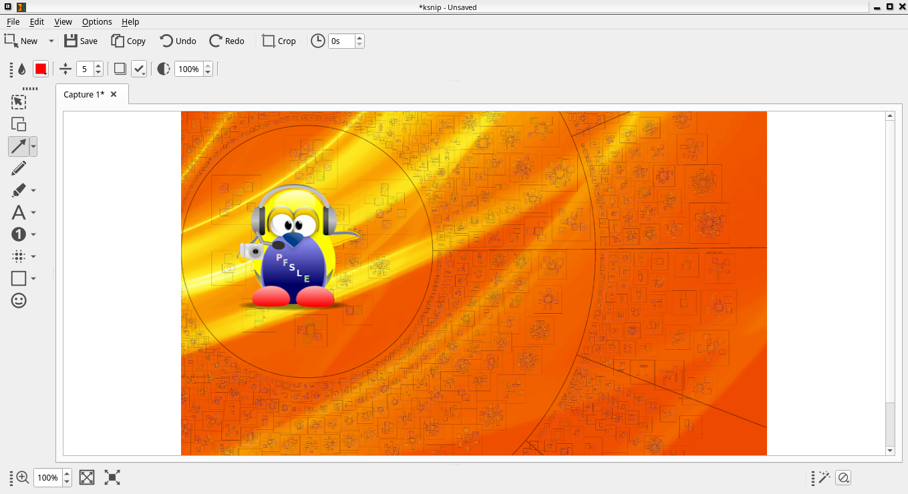

# ksnip PyQt6 Port

[](ROADMAP.md)
[](pyproject.toml)
[](pyproject.toml)
[](#debian-13--mx-linux-25)
[](#debian-13--mx-linux-25)
[](LICENSE.txt)
[](#contributing)
[](https://github.com/wachin/ksnip/issues)
[](https://github.com/wachin/ksnip/stargazers)

An active port of the [ksnip](https://github.com/ksnip/ksnip) screenshot and annotation application from C++/Qt to Python/PyQt6.

The port lives in `ksnip_py/` and aims to preserve the original application structure, workflow, icons, settings hierarchy, and kImageAnnotator behavior. It is already usable, but it is still under development and is not a finished replacement for upstream ksnip.



## Help wanted

Developers, testers, designers, Debian packagers, and translators are welcome. The most useful areas for contributions are:

- Wayland and `xdg-desktop-portal` capture support.
- Native global hotkeys.
- Fine visual parity with the original toolbar, editor, and settings dialog.
- Remaining kImageAnnotator behavior and effects.
- Imgur, FTP, OCR, and plugin-system parity.
- Automated GUI tests.
- Debian packaging and policy review.

See [ROADMAP.md](ROADMAP.md) for the detailed implementation status and reference screenshots.

## Current features

- Rectangular, last-area, full-screen, current-screen, active-window, and window-under-cursor capture modes.
- Optional real X11 cursor capture through XFixes, inserted as an editable image item.
- Capture delay, implicit delay, startup capture, auto-copy, and auto-save preferences.
- Open, paste, embedded paste, save, save as, save all, rename, delete, print, and print preview.
- Editable `.ksnip` project files and SVG export for continued editing in Inkscape.
- Multiple image tabs with dirty-state tracking and dynamic window titles.
- Recent images, containing-directory access, path copying, and Data URI copying.
- Annotation tools for selection, pen, markers, lines, arrows, shapes, text, numbers, blur, pixelate, stickers, and crop.
- Inline multiline text editing with re-editing and Hunspell-backed spelling suggestions.
- Multiple selection, move, resize, duplicate, ordering, copy/paste, undo, and redo.
- Rotate, scale, crop, and modify-canvas operations.
- Watermarks and always-on-top pin windows.
- Script uploader and experimental PaddleOCR/script OCR backends.
- System tray workflow and configurable application shortcuts.
- Hierarchical settings dialog modeled after the original C++ application.
- Command-line image opening, standard-input images, capture-mode selection, direct saving, cursor capture, and script upload.
- Generic `xdg-desktop-portal` capture with desktop/session diagnostics and backend recommendations.
- Nine sticker collections with persistent favorites and last-tab restoration, including user-imported images.

## Known gaps

- Live capture validation across X11, Wayland, mixed-DPI systems, and different portal backends.
- Native OS-global hotkey registration.
- Complete C++ plugin-system parity.
- Native Imgur and FTP uploaders.
- Complete startup, tray-menu, OCR modeless-window, and command-line parity with the C++ application.
- Exact visual and behavioral parity across every editor control.
- Final Debian packaging and automated GUI coverage.

## Debian 13 / MX Linux 25

The current development environment is AV Linux MXe based on Debian 13 and MX Linux 25.

Install the system runtime and development dependencies:

```bash
sudo apt update
sudo apt install \
  python3-pyqt6 \
  python3-venv \
  python3-pip \
  hunspell \
  hunspell-en-us \
  hunspell-es \
  libxcb-cursor0 \
  libxfixes3 \
  qt6-translations-l10n \
  xdg-desktop-portal \
  xdg-desktop-portal-gtk \
  x11-utils \
  xdotool
```

Important X11 dependencies:

- `libxcb-cursor0` is required by the Qt 6 `xcb` platform plugin. Without it, PyQt6 may fail to start on X11.
- `libxfixes3` is used to capture the real mouse cursor.
- `x11-utils` supplies helpers used for active-window geometry.
- `xdotool` is used to identify the window under the cursor.
- `qt6-translations-l10n` provides the official translations for standard Qt6
  controls such as file-dialog buttons, menus, and labels. It is separate from
  the translation catalogs maintained by ksnip_py itself.

Portal dependencies:

- `xdg-desktop-portal` is the desktop-independent frontend used by `--portal`.
- One backend is also required. Backend selection follows `XDG_CURRENT_DESKTOP`, not merely the window manager currently drawing windows.
- For AV Linux MXe, MX Linux, XFCE, LXDE, Openbox, Fluxbox, and IceWM sessions, `xdg-desktop-portal-gtk` is the practical default. Bare or manually assembled window-manager sessions may additionally need a `portals.conf` configuration and a correctly exported `XDG_CURRENT_DESKTOP`.
- Use `xdg-desktop-portal-kde` for Plasma, `xdg-desktop-portal-lxqt` for LXQt, `xdg-desktop-portal-xapp` for Cinnamon, `xdg-desktop-portal-phosh` for Phosh, and `xdg-desktop-portal-wlr` for wlroots-based Wayland compositors. GNOME/Ubuntu sessions normally use `xdg-desktop-portal-gnome`.
- ksnip reports the detected desktop and session type and recommends a package if portal capture is unavailable.

The `xdg-desktop-portal-dev` package is not a runtime dependency. It contains development files used to build portal backend implementations; this PyQt6 port is a portal client over D-Bus and does not need it.

Hunspell dictionaries are optional but recommended. Install the dictionary packages appropriate for your language if they differ from the English and Spanish examples above.

The source-artwork extraction tools are development utilities, not runtime
requirements. Regenerating the Geeko, Konqi & Katie, or GNU Baby collections additionally
requires `python3-pil`, `python3-numpy`, and `python3-scipy`.

## Sticker collections and artwork sources

The sticker selector provides ten tabs: Original, Papirus, GNOME, Numix, SuperTux, TuxBaby, Konqi & Katie, Geeko, GNU Baby, and User. The bundled themes use high-resolution sources, exclude symbolic-link duplicates, remember the last tab, and preserve pinned favorites across theme changes and application restarts. The User tab imports common image formats, preserves transparency and aspect ratio, converts them to PNG with a maximum dimension of 512 px, and stores them in the application's configuration directory; that directory can also be opened directly in the file manager. Copyright notices and licenses for bundled artwork are documented in `THIRD_PARTY_LICENSES.md`, `LICENSES/`, and `debian/copyright`.

The TuxBaby collection is © 2026 Washington Indacochea Delgado and licensed under CC BY-SA 4.0. It was generated under his creative direction with assistance from ChatGPT's image-generation capabilities and is inspired by Tux, created by Larry Ewing using The GIMP. See `ksnip_py/licenses/TUXBABY_LICENSE.md` for the complete attribution and license notice.

The unofficial Konqi and Katie sticker collection is © 2026 Washington Indacochea Delgado and licensed under CC BY-SA 4.0. It was generated under his creative direction with assistance from ChatGPT and is based on KDE's Konqi and Katie mascot designs by Tyson Tan. See `ksnip_py/licenses/KONQI_KATIE_LICENSE.md` for attribution, licensing, and trademark notices.

The unofficial Geeko sticker collection is © 2026 Washington Indacochea Delgado and licensed under CC BY-SA 4.0. It was generated under his creative direction with assistance from ChatGPT and is based on Geeko, the SUSE and openSUSE chameleon mascot. See `ksnip_py/licenses/GEEKO_LICENSE.md` for attribution, licensing, and trademark notices.

The unofficial GNU Baby sticker collection is © 2026 Washington Indacochea Delgado and licensed under CC BY-SA 2.0. It was generated under his creative direction with assistance from ChatGPT and is inspired by the GNU Head created by Etienne Suvasa. See `ksnip_py/licenses/GNUBABY_LICENSE.md` for attribution, licensing, and the GNU trademark notice.

Large contact sheets and other working artwork are kept under
`artwork-sources/`, outside the installed Python package. Reproducible
extractors under `tools/` generate the optimized 256×256 transparent PNGs used
by the application. See `artwork-sources/README.md` for the exact commands.

## Editable projects and SVG

Choose `File > Save As... > Ksnip Project` to save a `.ksnip` project. The format is a ZIP container with `project.json` and `background.png`; it preserves editable annotations, embedded images and stickers, the image effect, zoom, and number-tool state. Opening the `.ksnip` file restores the editor rather than flattening the annotations.

Whenever a `.ksnip` project is saved, ksnip_py also updates a flattened image beside it with the same base name. PNG is used by default; choose PNG, JPEG, WebP, or BMP under `Settings > Saver > Image saved alongside Ksnip projects`.

New files use PNG as their primary save format by default. Under `Settings > Saver > Default save format`, users can switch the default between a flattened PNG image and an editable `.ksnip` project.

Choose `File > Export as SVG...` to create a document for Inkscape. The screenshot is embedded as PNG while supported annotations remain SVG vectors and text. Raster overlays are embedded as PNG. SVG is intended for interchange with vector editors; use `.ksnip` as the lossless working project format.

For `Number Arrow`, the properties toolbar controls the shaft thickness and arrowhead size independently. These values remain editable in `.ksnip` projects and are preserved during SVG export. Hover over a property control to see a short explanation of its purpose.

## Run from system packages

```bash
git clone https://github.com/wachin/ksnip.git
cd ksnip
python3 -m ksnip_py
```

## Run from a virtual environment

Debian uses an externally managed system Python, so Python-only optional dependencies should be installed in a virtual environment:

```bash
git clone https://github.com/wachin/ksnip.git
cd ksnip

python3 -m venv .venv
source .venv/bin/activate
python -m pip install --upgrade pip setuptools wheel
python -m pip install -e .

ksnip-pyqt6
```

The spell checker continues to use the system `hunspell` executable and dictionaries when the application runs inside a virtual environment.

Qt's standard translations are resolved from the Qt runtime selected by
PyQt6 through `QLibraryInfo.TranslationsPath`. A pip installation therefore
does not assume Debian's `/usr/share/qt6/translations` path. On Windows and
macOS there is no `qt6-translations-l10n` package: the PyQt6/Qt deployment must
ship the desired `qtbase_<locale>.qm` catalogs in its own Qt translations
directory. On Linux, ksnip_py additionally checks the standard XDG data
directories, allowing a pip PyQt6 environment to use distribution-provided
Qt6 catalogs when compatible ones are available.

## Desktop theme integration

On GTK-based desktops, the following can help Qt use the desktop file-dialog and menu theme:

```bash
QT_QPA_PLATFORMTHEME=gtk3 python3 -m ksnip_py
```

## Command line

```text
ksnip-pyqt6 [IMAGE]
ksnip-pyqt6 --edit IMAGE
cat image.png | ksnip-pyqt6 --edit -
ksnip-pyqt6 --rectarea
ksnip-pyqt6 --lastrectarea
ksnip-pyqt6 --fullscreen
ksnip-pyqt6 --current
ksnip-pyqt6 --active
ksnip-pyqt6 --windowundercursor
ksnip-pyqt6 --portal
ksnip-pyqt6 --delay SECONDS --fullscreen
ksnip-pyqt6 --fullscreen --cursor
ksnip-pyqt6 --fullscreen --save
ksnip-pyqt6 --current --saveto /path/to/capture.png
ksnip-pyqt6 --current --upload
ksnip-pyqt6 --fullscreen --save --upload
```

Use `ksnip-pyqt6 --help` for the current option list. `--upload` uses the script configured under `Settings > Uploader > Script Uploader`. On Wayland, `--portal` delegates capture selection to `xdg-desktop-portal`.

All command-line options from the C++ implementation are supported. The
detailed C++ → PyQt6 option audit, intentional extensions, and corrected
legacy parser defects are recorded in `docs/CLI_PARITY.md`.

Wayland sessions are detected automatically and regular capture actions are redirected through `xdg-desktop-portal`. `Settings > Image Grabber > Force Generic Wayland` applies the same behavior manually, including on X11. Full-screen capture is requested non-interactively; the other capture modes use the portal's interactive chooser.

`Scale Generic Wayland Screenshots` applies the primary screen's Qt device-pixel ratio to the portal image without resampling its pixels, matching the C++ implementation. Because the screenshot portal does not identify the source monitor, mixed-DPI systems may need this option left disabled. The capture backend audit and live-validation matrix are documented in `docs/CAPTURE_BACKEND_PARITY.md`.

The shortcuts edited under `Settings > HotKeys` are application shortcuts and work while ksnip is active. For reliable system-wide shortcuts on both X11 and Wayland, configure the desktop or window manager to execute ksnip's command-line capture actions. Suggested commands and the native-hotkey design decision are documented in `docs/GLOBAL_HOTKEYS.md`.

Single-instance mode is enabled by default and can be changed under `Settings > Application`. Additional invocations forward their command-line arguments to the existing process through a per-user Qt local socket, allowing it to show the editor, open an image, or perform a capture without starting a second GUI instance.
Images supplied through standard input are forwarded as image bytes when another instance is already running.

The PyQt6 port loads Qt Linguist `.qm` catalogs using the language selected under `Settings > Application > Language`, or the system locale by default. Use `--language LOCALE` (for example, `--language es`, `de`, `pt_BR` or `zh_Hant`) for a temporary command-line override. The language selector is generated from the 41 catalogs shipped with the package. Missing messages safely fall back to English.

The official `qtbase_*.qm` catalog is loaded separately for standard Qt6
widgets, including the Open and Save dialogs. Its location comes primarily
from `QLibraryInfo.TranslationsPath`; see `docs/FILE_DIALOGS.md` for the
Unicode bookmark diagnosis, Linux fallback, and Windows/macOS deployment
behavior.

Compatible strings from the original C++ `ksnip` catalogs are reused by the port. The `ksnip_py` catalog contains messages that only exist in the Python implementation.

Translation workflow for contributors. The synchronization script extracts the Python messages, reuses matching translations from the original `ksnip` and `kImageAnnotator` catalogs, and compiles every `.qm` file:

```bash
python3 tools/update_pyqt_translations.py
```

## Text tool

1. Select `Text`.
2. Drag a rectangle on the screenshot.
3. Type directly in the inline editor.
4. Press `Ctrl+Enter` to accept or `Esc` to cancel a new text item.
5. Double-click an existing text item, or use `Edit text`, to edit it again.

Hunspell automatically detects installed dictionaries, underlines misspelled words, and provides replacement suggestions in the context menu.

## Optional OCR

OCR is experimental and does not prevent the application from starting when PaddleOCR is unavailable. A script backend can also be configured in Settings.

### Tested Linux OCR environment

The integrated PaddleOCR backend has been successfully tested on the following
reference system:

| Component | Tested version |
| --- | --- |
| Distribution | AV Linux MXe (`AVL-MXe 25.2 Ease`), from the MX Linux 25 family |
| Debian base | Debian GNU/Linux 13.6 (`trixie`) |
| Architecture | x86_64 |
| Python (system and virtual environment) | 3.13.5 |
| PyQt6 | 6.11.0 |
| Qt runtime | 6.11.0 |
| PaddleOCR | 3.7.0 |
| PaddlePaddle | 3.3.1 |
| Protobuf | 3.20.2 |

This is the known-working reference configuration used to implement and test
OCR. It is expected to work on comparable Debian 13 and derivative systems,
including compatible MX Linux, AV Linux, Ubuntu, and Linux Mint releases, when
the same Python OCR dependencies are available. Those other distributions and
versions should be treated as compatible candidates rather than as tested
configurations until somebody reports a successful test.

On Debian and derivatives, the supported installation method for PaddleOCR is
a Python virtual environment. Do not install it with `sudo pip` or
`--break-system-packages`. Create and prepare the environment once:

```bash
python3 -m venv .venv
source .venv/bin/activate
python -m pip install --upgrade pip setuptools wheel
python -m pip install -e .
python -m pip install -r requirements-ocr.txt
```

The requirements file pins Protobuf to the version currently compatible with
PaddlePaddle. Newer Protobuf releases can make PaddleOCR fail while loading its
generated descriptors and can then leave `paddle` partially initialized until
the application is restarted.

On its first use PaddleOCR downloads its models into the user's PaddleX cache,
so the initial recognition takes longer and needs network access. Later runs
reuse those files. ksnip_py disables oneDNN for this tested CPU configuration
and omits document-orientation models that are unnecessary for screenshots.

For later sessions, either activate the environment before starting ksnip:

```bash
source .venv/bin/activate
python -m ksnip_py
```

or use the included launcher, which selects `.venv/bin/python` automatically
and verifies that PaddleOCR is available:

```bash
./scripts/run-ksnip-with-paddleocr.sh
```

The launcher does not install packages automatically; the initial virtual
environment setup is still required. Detailed Spanish instructions, command
line examples, and support for a custom environment location are available in
[`docs/OCR_PADDLEOCR_ES.md`](docs/OCR_PADDLEOCR_ES.md).

Current limitations:

- Cancellation is best-effort after a backend call has started.
- Live PaddleOCR recognition has not yet received full automated coverage.
- Plugin and modeless-window behavior does not yet match the C++ implementation completely.

## Project layout

```text
ksnip_py/       Active PyQt6 implementation
src/            Original C++ ksnip reference implementation
libraries/      kImageAnnotator and kColorPicker reference submodules
artwork-sources/ Source sheets used to generate packaged sticker assets
images/         UI and behavior reference screenshots
debian/         Initial Debian packaging scaffold
ROADMAP.md      Detailed port status and next work blocks
pyproject.toml  Python package and executable metadata
```

The `kColorPicker` and `kImageAnnotator` git submodules are behavioral references, not Python runtime dependencies. After a fresh clone, initialize them with:

```bash
git submodule update --init --recursive
```

## Development checks

Run the complete Python test suite before and after a change:

```bash
python3 -m pytest tests_py -q
```

For quick syntax and CLI checks:

```bash
python3 -m compileall -q ksnip_py
python3 -m ksnip_py --help
```

For a headless startup smoke test:

```bash
timeout 8s env QT_QPA_PLATFORM=offscreen python3 -m ksnip_py
```

The current suite contains 92 tests covering the canvas, settings, capture
helpers, projects, sticker selection, upload helpers, translation behavior,
and other port infrastructure. The exact count may grow over time; a clean run
is more important than the number.

## Port completion and C++ reference policy

The original C++ implementation is still required as a behavioral and visual
reference. Do not remove `src/`, `tests/`, `libraries/`, `cmake/`, the root
`CMakeLists.txt`, or the original translation catalogs while unchecked porting
tasks still depend on them.

The prioritized completion sequence is:

1. Audit command-line, startup, capture, annotation, tray, OCR, and uploader behavior against C++.
2. Implement or explicitly reject the remaining Imgur, FTP, plugin, and configurable-action features.
3. Finish visual parity and migrate every visible string through Qt Linguist.
4. Expand GUI tests and complete Debian packaging and policy review.
5. Preserve the last C++ revision in a historical branch or tag, migrate legacy CI/package jobs, and only then remove the C++ tree in an independent change.

The next bounded audit is `src/backend/commandLine/CommandLine.cpp` versus
`ksnip_py/app.py`. See [ROADMAP.md](ROADMAP.md) for the authoritative checklist.

## Contributing

1. Read [ROADMAP.md](ROADMAP.md).
2. Pick one small unchecked item from the prioritized completion plan.
3. Compare against the C++ sources and the reference screenshots before changing behavior.
4. Keep unrelated user changes intact.
5. Add a focused smoke test or reproducible verification when possible.
6. Open an issue or pull request at [wachin/ksnip](https://github.com/wachin/ksnip).

Please mention your desktop environment, display protocol (`X11` or `Wayland`), Python version, PyQt6 version, and reproduction steps in bug reports.

## Packaging status

The `debian/` directory contains an initial scaffold only. The Python wheel
already includes the application icons, translations, licenses, and bundled
stickers, but the Debian package should not be considered policy-complete or
ready for submission until runtime dependencies, desktop integration,
AppStream metadata, manual pages, copyright coverage, clean builds, and
`lintian` results have been reviewed.

## License

This project follows the existing ksnip licensing terms. See [LICENSE.txt](LICENSE.txt).
